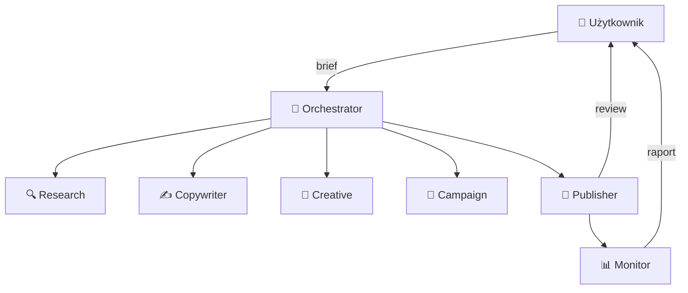

# PRD: Uniwersalni Agenci Reklamowi (Ad Agents)

> **Data:** 2026-02-28 · **Status:** Draft · **Typ:** Narzędzie wieloprojektowe (nie Lilapu-specific)

---

## 1. Cel

System agentów AI, który **autonomicznie tworzy kampanie reklamowe** na Google Ads, Meta Ads, LinkedIn i TikTok — dla dowolnego produktu/projektu. Użytkownik podaje brief, dostaje gotowy pakiet (copy + kreacje + targeting) do zaakceptowania jednym klikiem.

**Kluczowa zasada:** User kontroluje budżet i akceptuje reklamy. Agent robi resztę.

---

## 2. Flow użytkownika

```
1. User → brief: "Zareklamuj [produkt] dla [grupy docelowej]"
2. 🔍 Research Agent → przeszukuje ad libraries + narzędzia spy
   → raport: co działa w branży, jakie formaty, jakie copy
3. ✍️ Copywriter Agent → generuje warianty A/B copy per platforma
4. 🎨 Creative Agent → grafiki (bannery) + wideo (15-30s)
5. 🎯 Campaign Agent → targeting + budżet + bidding per platforma
6. 👤 User → review pakietu → ✅ AKCEPTUJ / ❌ ODRZUĆ / ✏️ POPRAW
7. 🚀 Publisher Agent → publikuje + monitoruje 48h → raport wyników
```

---

## 3. Architektura

### 3.1 Hub & Spoke



### 3.2 Agenci — szczegóły

| Agent | Input | Output | Narzędzia |
|-------|-------|--------|-----------|
| **Research** | brief + branża + konkurencja | raport: top kreacje, formaty, CTA, trendy | Meta Ad Library API, narzędzia 3rd party (patrz §4) |
| **Copywriter** | raport Research + brief | 3-5 wariantów copy per platforma (dostosowane do formatek) | LLM (patrz §6) |
| **Creative** | raport Research + copy + brand assets | PNG/JPG bannery + MP4 wideo | Image/video gen API (patrz §6) |
| **Campaign** | brief + copy + kreacje | konfiguracja kampanii (JSON) per platforma | Google/Meta/TikTok/LinkedIn API |
| **Publisher** | zatwierdzone kampanie | live kampanie + deployment status | platformowe API |
| **Monitor** | live kampanie | raport performance (CTR, CPC, ROAS) + alerty | platformowe reporting API |

---

## 4. Research Agent — implementacja

### Problem
Platformy **nie dają publicznego API do metryk skuteczności** reklam konkurencji. Ad Library API (Meta) daje kreacje ale nie CTR/CPC.

### Rozwiązanie: warstwa hybrydowa

| Źródło | Typ dostępu | Co daje |
|--------|-------------|---------|
| **Meta Ad Library API** | Oficjalny API (dev account + weryfikacja) | Kreacje konkurencji, copy, daty, platformy. **Brak metryk.** |
| **Google Ads Transparency Center** | Brak API — web scraping | Reklamy Google konkurencji |
| **TikTok Creative Center** | Brak oficjalnego API | Top performing ads w kategorii, trendy |
| **3rd party: AdSpy / SpyFu / SimilarWeb** | Płatne API lub scraping | Estymowane metryki: engagement, reach, spend |
| **Own intelligence** | LLM analiza zebranych kreacji | Wzorce: najczęstsze CTA, długość copy, kolorystyka, formaty |

### Research Agent output

```yaml
raport:
  branża: "SaaS / productivity"
  przeanalizowano: 127 reklam
  top_formaty:
    - "wideo 15s z demo produktu (42% reklam)"
    - "karuzela before/after (28%)"
    - "statyczny banner z social proof (18%)"
  top_cta:
    - "Wypróbuj za darmo"
    - "Zobacz demo"
    - "Zacznij teraz"
  copy_insights:
    - "Średnia długość headline: 6 słów"
    - "87% reklam używa liczb w headline"
    - "Ton: profesjonalny ale bezpośredni"
  rekomendacja: "Wideo 15s z demo + CTA 'Wypróbuj za darmo' + social proof w overlay"
```

---

## 5. API platform reklamowych

### 5.1 Meta (Facebook/Instagram)

| Funkcja | API | Dostęp | Uwagi |
|---------|-----|--------|-------|
| Research | Ad Library API | Dev account + weryfikacja tożsamości | Read-only, brak metryk CTR/CPC |
| Publikacja | Marketing API v21+ | Business Manager + App Review + `ads_management` | OAuth2, rate limits |
| Reporting | Marketing API Insights | Jak wyżej | 13-mies. retencja danych |

### 5.2 Google Ads

| Funkcja | API | Dostęp | Uwagi |
|---------|-----|--------|-------|
| Research | Brak oficjalnego API | 3rd party (SpyFu, SEMrush) | — |
| Publikacja | Google Ads API v19+ | Manager account + developer token + OAuth2 | Python/JS client libraries |
| Reporting | Google Ads API Reports | Jak wyżej | — |

### 5.3 TikTok

| Funkcja | API | Dostęp | Uwagi |
|---------|-----|--------|-------|
| Research | Creative Center (brak API) | 3rd party lub scraping | — |
| Publikacja | TikTok Marketing API | Developer registration + app approval | Sandbox do testów |
| Reporting | TikTok Reporting API | Jak wyżej | — |

### 5.4 LinkedIn

| Funkcja | API | Dostęp | Uwagi |
|---------|-----|--------|-------|
| Research | Brak API | Manual lub 3rd party | — |
| Publikacja | LinkedIn Marketing API | Approval od LinkedIn (formularz + review) | `rw_ads`, limity kampanii |
| Reporting | LinkedIn Analytics API | Jak wyżej | — |

---

## 6. Tech Stack

### 6.1 Backend & Orchestration

| Warstwa | Technologia | Dlaczego |
|---------|-------------|----------|
| **Orchestrator** | Next.js API routes + Inngest (event-driven jobs) | Długie joby (generacja wideo = minuty), retry, scheduling |
| **Database** | PostgreSQL (Supabase) lub Convex | Kampanie, kreacje, logi, tokeny (encrypted) |
| **Job queue** | Inngest lub BullMQ + Redis | Polling RunPod, monitoring kampanii co 6h, retry na API errors |
| **File storage** | S3 / Cloudflare R2 | Kreacje (grafiki, wideo) — platformy wymagają URL do pobrania |
| **Auth** | Clerk (multi-tenant) | User identity, project isolation |

### 6.2 AI Models

| Funkcja | Model | Hosting | Koszt estymowany |
|---------|-------|---------|------------------|
| **Copy generation** | GPT-4o (API) | OpenAI | ~$0.01 per reklama |
| **Research analysis** | GPT-4o lub Claude | API | ~$0.03 per raport |
| **Image generation** | Flux 1.1 Pro | Replicate lub self-hosted (RunPod) | ~$0.04 per obraz |
| **Video generation** | Kling 2.0 / Runway Gen-3 | API | ~$0.50-2.00 per wideo 15s |
| **Talking head** | HeyGen | API | ~$1.00 per wideo 30s |

> **Dlaczego nie Bielik?** Copy reklamowe wymaga natywnej wielojęzyczności i kreatywności. GPT-4o jest znacznie lepszy w generowaniu chwytliwych headline'ów PL/EN niż Bielik. Bielik lepszy do analizy/podsumowań (jak w Lilapu), nie do reklam.

### 6.3 Scheduling & Monitoring

| Zadanie | Częstotliwość | Narzędzie |
|---------|---------------|-----------|
| Monitor performance kampanii | Co 6h | Cron (Inngest scheduled) |
| Alert: kampania poniżej threshold | Realtime check | Webhook / email |
| Auto-pause: budżet exceeded | Event-driven | Publisher Agent |
| Weekly raport | Co poniedziałek 9:00 | Scheduled job |

---

## 7. Formaty kreacji per platforma

| Platforma | Statyczne | Wideo | Aspect Ratio |
|-----------|-----------|-------|--------------|
| **Meta** (Feed) | 1080×1080, 1200×628 | 1:1, 4:5 (do 240s) | 1:1, 4:5 |
| **Meta** (Stories/Reels) | 1080×1920 | 9:16 (do 120s) | 9:16 |
| **Google** (Display) | 1200×628, 300×250, 728×90 | YouTube: 16:9 | varies |
| **Google** (Search) | tekst only | — | — |
| **TikTok** | 1080×1920 | 9:16 (9-60s, sweet spot: 15-30s) | 9:16 |
| **LinkedIn** | 1200×627, 1080×1080 | 16:9, 1:1 (do 30min) | 16:9, 1:1 |

---

## 8. Security

### 8.1 OAuth2 Token Management

```
User łączy konto reklamowe → OAuth2 flow → access_token + refresh_token
→ Encrypted at rest (AES-256-GCM) w DB
→ Refresh przed expiry (cron job)
→ Izolacja per user (multi-tenant) — user A nie widzi tokenów user B
```

| Wymóg | Implementacja |
|-------|---------------|
| Token encryption at rest | AES-256-GCM, klucz per environment (env var) |
| Token refresh | Background job, 1h przed expiry |
| Token revocation | User może odłączyć platformę → natychmiastowe usunięcie tokena |
| Multi-tenant isolation | Tokeny scoped do `userId`, query zawsze filtrowany |
| Audit log | Każde użycie tokena logowane: kto, kiedy, jaki endpoint |

### 8.2 Budget Guardrails (krytyczne)

Agent zarządza **prawdziwymi pieniędzmi**. Hard limits:

| Guardrail | Implementacja |
|-----------|---------------|
| **Max daily spend per kampania** | User ustawia limit → Campaign Agent nie może przekroczyć |
| **Max total spend per kampania** | Hard cap w DB → Publisher nie wyda więcej |
| **Global daily limit per user** | Suma wszystkich kampanii ≤ global cap |
| **Double-spend protection** | Idempotency key na każde API call do platformy |
| **Auto-pause** | Jeśli spend > 120% dziennego limitu → natychmiastowy pause + alert |
| **Dry-run mode** | Kampania tworzona jako PAUSED → user musi ręcznie aktywować (opcja) |

> [!CAUTION]
> Agent **nigdy** nie może samodzielnie zwiększyć budżetu. Tylko user — przez explicit UI action.

### 8.3 Content Policy Pre-Check

Każda platforma ma zasady reklamowe. Agent sprawdza ZANIM wyśle:

| Check | Co robi |
|-------|---------|
| **Prohibited content** | LLM classifies: alkohol, tytoń, broń, hazard, opieka zdrowotna (restricted categories) |
| **Text-in-image ratio** | Meta: max 20% tekstu na grafice (soft rule) |
| **Landing page** | URL musi być live i odpowiadać treści reklamy |
| **Disclaimer** | Finanse/zdrowie — wymagane disclaimery per platforma |

Jeśli pre-check failu → Orchestrator wraca do Copywriter/Creative z feedbackiem.

### 8.4 Audit Trail

```sql
ad_agent_audit_log:
  id, userId, projectId, timestamp,
  agentName,           -- "research" | "copywriter" | "creative" | "campaign" | "publisher"
  action,              -- "generate_copy" | "create_campaign" | "publish" | "pause" | "spend"
  platformName,        -- "meta" | "google" | "tiktok" | "linkedin"
  details,             -- JSON: co dokładnie (campaign_id, spend_amount, etc.)
  status,              -- "success" | "rejected" | "error"
  spendAmount,         -- nullable, w PLN
```

Każda akcja agenta jest logowana. User widzi pełną historię w UI.

### 8.5 Credential Isolation

```
Project A (Lilapu)     → Meta token A, Google token A
Project B (Bobby)      → Meta token B, Google token B
                       → NIGDY nie cross-access
```

Wszystkie query do DB filtrowane przez `userId` + `projectId`. Brak shared state między projektami.

---

## 9. Dane wejściowe (brief)

```yaml
# Uniwersalny brief — działa dla dowolnego projektu
projekt: "Nazwa produktu"
url: "https://example.com"
branża: "SaaS / e-commerce / edukacja / ..."
cel: "leady / sprzedaż / brand awareness / app installs"
grupa_docelowa: "opis grupy docelowej"
budżet_dzienny: 100                    # PLN, per platforma
max_budżet_total: 3000                 # PLN, hard cap
platformy: ["meta", "google", "tiktok"]
ton: "profesjonalny / casualowy / premium / ..."
konkurencja: ["competitor1.com", "competitor2.com"]
USP: "co wyróżnia produkt"
brand_assets:                          # opcjonalne
  logo: "url_do_logo"
  kolory: ["#7c5cfc", "#1a1a2e"]
  czcionka: "Inter"
język: "pl"                            # pl / en / multi
```

---

## 10. Output do akceptacji

```
📦 Kampania: "[Produkt] — [Cel] — [Miesiąc]"
│
├── 📊 Raport Research
│   ├── Analiza 100+ reklam konkurencji
│   ├── Top formaty, CTA, długość copy
│   └── Strategiczna rekomendacja
│
├── ✍️ Copy (3-5 wariantów × N platform)
│   ├── Meta: headline + primary text + CTA
│   ├── Google Search: 15 headlines (30 zn.) + 4 descriptions (90 zn.)
│   ├── TikTok: overlay text + hook + CTA
│   └── LinkedIn: intro text + headline
│
├── 🎨 Kreacje
│   ├── 3× banner 1:1 (Meta/LinkedIn feed)
│   ├── 3× banner 9:16 (Stories/Reels/TikTok)
│   ├── Opcjonalnie: 1× wideo 15s
│   └── Preview mockup per platforma
│
├── 🎯 Targeting & Budżet
│   ├── Per platforma: audience + bidding + daily budget
│   └── Estymowany reach + CPM
│
├── 🛡️ Policy Pre-Check
│   └── ✅ Passed / ⚠️ Warnings
│
└── ✅ [AKCEPTUJ] ❌ [ODRZUĆ] ✏️ [POPRAW: instrukcja]
```

---

## 11. Kluczowe decyzje do podjęcia

| # | Decyzja | Opcje | Status |
|---|---------|-------|--------|
| 1 | **Gdzie to żyje?** | Osobna apka SaaS / CLI / moduł w istniejącym projekcie | ❓ |
| 2 | **Image gen** | Flux (self-hosted) / DALL-E 3 / Midjourney | ❓ |
| 3 | **Video gen** | Kling / Runway / HeyGen / brak na start | ❓ |
| 4 | **Research 3rd party** | AdSpy ($149/mies) / SpyFu / SimilarWeb / manual | ❓ |
| 5 | **Start z ilu platform?** | Wszystkie 4 naraz / najpierw Meta + Google | ❓ |
| 6 | **Dry-run default?** | Kampanie startują jako PAUSED czy ACTIVE? | ❓ |
| 7 | **Hosting** | Vercel + Supabase / VPS / Convex | ❓ |

---

## 12. Estymacja

| Faza | Opis | Estymacja |
|------|------|-----------|
| **Phase 0** | Projekt setup, konta dev, OAuth flows × 4 platformy | ~12h |
| **Phase 1** | Research Agent (Meta Ad Library + 3rd party integration) | ~20h |
| **Phase 2** | Copywriter Agent (LLM + formatki per platforma) | ~12h |
| **Phase 3** | Creative Agent (static images + templates) | ~24h |
| **Phase 4** | Campaign Agent (API integration × 4 platformy) | ~40h |
| **Phase 5** | Publisher Agent (deploy + auto-pause + monitoring) | ~20h |
| **Phase 6** | Security: token vault, budget guardrails, audit trail | ~16h |
| **Phase 7** | UI: brief form, review panel, dashboard | ~20h |
| **Phase 8** | Orchestrator + Inngest job flows | ~16h |
| **Phase 9** | Video gen integration (opcjonalne) | ~16h |
| **Total** | | **~196h** |

### MVP vs Full

| Scope | Co zawiera | Estymacja |
|-------|-----------|-----------|
| **MVP** | Research + Copy + Static images + Meta only + manual publish | ~60h |
| **v1.0** | + Google Ads + auto publish + monitoring | ~120h |
| **v2.0** | + TikTok + LinkedIn + video gen + A/B testing | ~196h |

---

## 13. Ryzyka

| Ryzyko | Impact | Mitygacja |
|--------|--------|-----------|
| **Platforma odmówi API access** | Blokuje auto-publikację | Fallback: agent generuje gotowe materiały → user wkleja ręcznie |
| **Reklamy odrzucone przez platformę** | Strata czasu + budżetu | Policy pre-check przed publikacją |
| **Runaway spend (bug w budżecie)** | Realne straty finansowe | Hard budget caps + auto-pause + double-spend protection |
| **Niska jakość kreacji AI** | Słabe wyniki kampanii | Human review obowiązkowy + iteracyjny feedback loop |
| **Koszty generacji wideo** | $1-2 per wideo × wiele wariantów | Budget cap per kampania na generację, cache szablonów |
| **Zmiana API platform** | Integracje się psują | Abstrakcja per platforma, wersjonowanie, monitoring deprecations |
| **OAuth token leak** | Dostęp do konta reklamowego usera | Encryption at rest, no logs, auto-revoke on anomaly |
