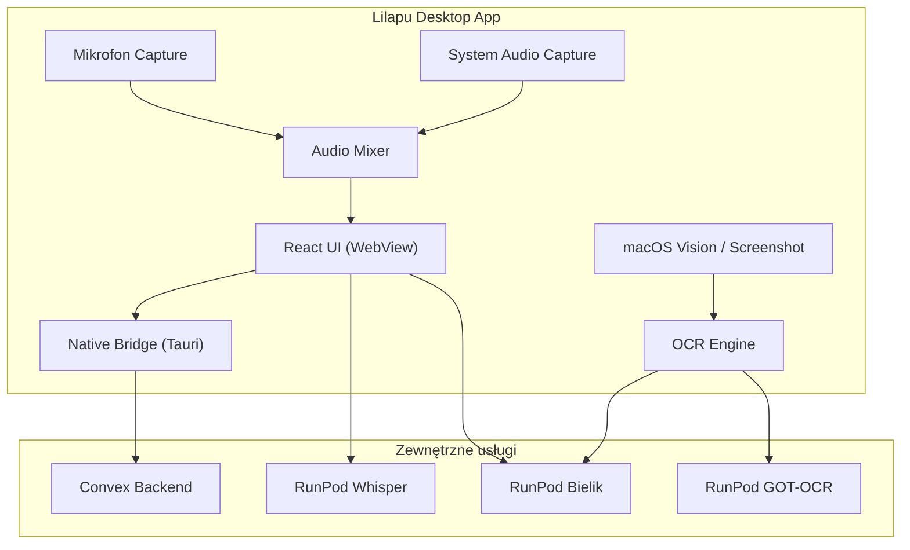

# Lilapu Desktop App — PRD

## Problem

Psycholodzy, coache i mentorzy prowadzą sesje online (Zoom, Meet, Teams) i potrzebują transkrypcji obu stron rozmowy. Obecna wersja web **nie może przechwycić głosu rozmówcy** ze słuchawek — mikrofon łapie tylko użytkownika. Desktop app rozwiązuje to przez przechwytywanie audio systemowego.

---

## Cele produktu

1. **Nagrywanie obu stron** rozmowy online (mikrofon + system audio)
2. **Zero konfiguracji** — działa od razu po instalacji, bez dodatkowych sterowników
3. **Pełna kompatybilność** z dowolną apką video (Zoom, Meet, Teams, FaceTime)
4. **E2EE zachowane** — te same mechanizmy szyfrowania co wersja web
5. **Identyczny interfejs** — użytkownik znający wersję web czuje się jak w domu
6. **Zaawansowany OCR** — screenshot→OCR, drag&drop, macOS Vision offline

---

## Strategia multi-platformowa

| Platforma | Rozwiązanie | System audio | OCR | Nagrywanie mic |
|-----------|------------|-------------|-----|----------------|
| **macOS** | Desktop app (Tauri) | ✅ | ✅ Pełne (screenshot, Vision) | ✅ |
| **Windows** | Desktop app (Tauri) | ✅ | ✅ Pełne (screenshot)  | ✅ |
| **iOS / Android / tablet** | **PWA** (już istnieje ✅) | ❌ | ✅ Kamera → RunPod | ✅ |

> [!NOTE]
> PWA obsługuje mobile/tablet. Desktop app jest potrzebna **wyłącznie** dla system audio capture i zaawansowanego OCR.

---

## Architektura



### Źródła audio

| Scenariusz | Mikrofon | System Audio | Wynik |
|---|---|---|---|
| Spotkanie online (słuchawki) | ✅ Twój głos | ✅ Głos rozmówcy | Pełna transkrypcja |
| Spotkanie online (głośnik) | ✅ Oba głosy | ⚠️ Opcjonalne | Pełna transkrypcja |
| Spotkanie na żywo (gabinet) | ✅ Oba głosy | ❌ Nie potrzebne | Pełna transkrypcja |

---

## Technologia

### Rekomendacja: **Tauri v2**

| Kryterium | Electron | Tauri v2 |
|---|---|---|
| Rozmiar instalki | ~150 MB | **~5 MB** |
| RAM usage | ~300 MB | **~50 MB** |
| Natywne API audio | Node.js addon | **Rust (cpal/rodio)** |
| Auto-update | electron-updater | **wbudowany** |
| Podpisanie kodu | Tak | **Tak** |
| macOS system audio | Wymaga BlackHole | **ScreenCaptureKit (natywny)** |
| Windows system audio | WASAPI loopback | **WASAPI loopback** |

> [!IMPORTANT]
> **Tauri v2** jest rekomendowany ze względu na mały rozmiar (5 MB vs 150 MB), niski RAM, i natywne API Rust do przechwytywania audio. Frontend (React) działa bez zmian w WebViewie.

### Audio Capture — mechanizmy per platforma

**macOS (Sonoma 14.4+):**
- `ScreenCaptureKit` — natywny API Apple do przechwytywania audio z apek
- Nie wymaga BlackHole ani żadnych dodatkowych sterowników
- Użytkownik musi jednorazowo zatwierdzić uprawnienie "Screen & System Audio Recording"

**macOS (starsze):**
- Fallback na BlackHole (auto-instalacja z poziomu apki lub prompt)

**Windows:**
- WASAPI Loopback — wbudowany w Windows, zero instalacji
- Przechwytuje audio wyjściowe systemu

---

## User Flow

### Pierwsza instalacja

```
1. Pobiera z lilapu.com/pobierz
   └─ macOS: Lilapu.dmg (5 MB)
   └─ Windows: Lilapu-Setup.exe (5 MB)

2. Instalacja
   └─ macOS: przeciąga do /Applications
   └─ Windows: Next → Next → Finish

3. Pierwsze uruchomienie
   └─ "Pozwolić Lilapu na mikrofon?" → Zezwól
   └─ macOS: "Pozwolić na nagrywanie audio?" → Zezwól
   └─ Logowanie (Clerk) → Hasło szyfrowania (E2EE)

4. Gotowe — ikona w:
   └─ macOS: menu bar (górny pasek)
   └─ Windows: system tray
```

### Codzienny use case — sesja online

```
1. Otwiera Zoom/Meet/Teams → rozpoczyna spotkanie
2. Klika ikonę Lilapu w menu bar → "🎙️ Nagrywaj rozmowę"
3. Wybiera tryb: 🎤 Mikrofon | 🖥️ Mikrofon + System Audio
4. Lilapu nagrywa w tle — miniaturowe okno z timerem
5. Po spotkaniu → Stop → Whisper transkrybuje → Bielik poleruje
6. Podsumowanie sesji generuje się automatycznie
7. Może dodać do notatek → dostępne w Chat AI
```

### Codzienny use case — gabinet (na żywo)

```
1. Klika "🎙️ Nagrywaj" → tryb: 🎤 Mikrofon (jak w wersji web)
2. Mikrofon łapie obie osoby w pokoju
3. Reszta identyczna — transkrypcja, polishing, podsumowanie
```

---

## Funkcje MVP

### P0 — Muszą być w v1.0

| # | Funkcja | Opis |
|---|---------|------|
| 1 | **Nagrywanie z mikrofonu** | Identyczne jak wersja web |
| 2 | **Nagrywanie system audio** | Przechwytuje audio z dowolnej apki |
| 3 | **MIX mikrofon + system** | Łączy oba strumienie w jeden |
| 4 | **Menu bar / System tray** | Szybki dostęp, timer nagrywania |
| 5 | **Logowanie (Clerk)** | Ten sam system auth co web |
| 6 | **E2EE** | Ten sam moduł crypto |
| 7 | **Transkrypcja (Whisper)** | RunPod, identyczna jak web |
| 8 | **Bielik polishing + summary** | Jak w web |
| 9 | **Dashboard** | Pełny interfejs: transkrypcje, notatki, Czat AI |
| 10 | **Auto-update** | Tauri wbudowany updater |
| 11 | **OCR import zdjęcia** | Jak w web — plik → RunPod GOT-OCR → Bielik |
| 12 | **Screenshot → OCR** | ⌘+Shift+S zaznacza fragment ekranu → OCR rozpoznaje tekst |
| 13 | **Drag & drop → OCR** | Przeciąga zdjęcie na ikonę Lilapu → OCR |

### P1 — Wersja 1.1

| # | Funkcja | Opis |
|---|---------|------|
| 1 | **Diaryzacja (kto mówi)** | Osobne ścieżki: mikrofon = Ty, system = Rozmówca |
| 2 | **Hotkey** | Globalny skrót klawiszowy (np. ⌘+Shift+R) |
| 3 | **Floating widget** | Mały pływający timer podczas nagrywania |
| 4 | **macOS Vision (offline OCR)** | Apple Vision Framework — OCR lokalnie, bez RunPod |
| 5 | **Windows OCR (offline)** | Windows.Media.Ocr — OCR lokalnie |
| 6 | **Offline mode** | Lokalna transkrypcja Whisper (whisper.cpp) gdy brak internetu |
| 7 | **Kamera na żywo → OCR** | Podgląd kamery, celowanie w notatkę, klik → OCR |

### P2 — Przyszłość

| # | Funkcja |
|---|---------|
| 1 | Real-time live transcription (WebSocket) |
| 2 | Integracja z kalendarzem (auto-nagrywanie) |
| 3 | iOS companion app (mikrofon only) |
| 4 | Wersja Linux |

---

## Struktura projektu

```
lilapu/
├── web/                     # Obecna wersja web (Next.js + Convex)
├── desktop/                 # NOWY — Tauri app
│   ├── src-tauri/          # Rust backend
│   │   ├── src/
│   │   │   ├── main.rs     # Entry point
│   │   │   ├── audio.rs    # System audio capture
│   │   │   ├── mixer.rs    # Mic + system audio mixer
│   │   │   └── tray.rs     # Menu bar / system tray
│   │   ├── Cargo.toml
│   │   └── tauri.conf.json
│   └── src/                # Frontend (React — shared z web)
│       ├── App.tsx
│       └── components/     # Reużywane komponenty z web/
├── convex/                  # Backend (bez zmian)
└── runpod-*/               # AI endpoints (bez zmian)
```

---

## Estymacja

| Faza | Czas | Opis |
|------|------|------|
| Setup Tauri + WebView | 1 dzień | Scaffold, React w WebView, Convex połączenie |
| System audio capture | 2 dni | ScreenCaptureKit (macOS) + WASAPI (Windows) |
| Audio mixer + nagrywanie | 1 dzień | Łączenie mikrofon + system, WAV encoding |
| Menu bar / tray | 0.5 dnia | Ikona, timer, start/stop |
| Packaging + signing | 1 dzień | .dmg, .exe, code signing, auto-update |
| Testowanie | 1.5 dnia | macOS + Windows manual QA |
| **TOTAL MVP** | **~7 dni** | |

---

## Ryzyka

| Ryzyko | Prawdopodobieństwo | Mitygacja |
|--------|-------------------|-----------|
| macOS pre-Sonoma brak ScreenCaptureKit | Średnie | Fallback: BlackHole auto-install |
| Apple code signing wymaga $99/rok Developer ID | ✅ Pewne | Konto Apple Developer potrzebne |
| Windows SmartScreen blokuje nieznane apki | Wysokie | EV code signing certificate (~$200/rok) |
| Tauri v2 audio cpal bugs | Niskie | Fallback: portaudio binding |

---

## Konkurencja

| Produkt | System Audio | Diaryzacja | E2EE | Polski | Cena |
|---------|-------------|------------|------|--------|------|
| **Otter.ai** | ✅ | ✅ | ❌ | ❌ | $16/mies |
| **Fireflies.ai** | ✅ | ✅ | ❌ | ⚠️ słabo | $18/mies |
| **Krisp** | ✅ | ❌ | ❌ | ❌ | $12/mies |
| **Tactiq** | ⚠️ Extension | ❌ | ❌ | ❌ | $12/mies |
| **Lilapu** | ✅ (MVP) | ✅ (P1) | **✅** | **✅** | TBD |

> [!TIP]
> **Przewaga Lilapu**: jedyne narzędzie z **E2EE + natywną obsługą polskiego** (Bielik). Dla psychologów i prawników E2EE to requirement, nie feature.

---

## Success Metrics (KPI)

| Metryka | Cel MVP | Narzędzie pomiaru |
|---------|---------|-------------------|
| **Czas przetwarzania** | ≤ 2 min na 30 min nagrania | Logi Convex (czas akcji) |
| **Crash-free sessions** | ≥ 99% | Tauri error handler + Sentry (P1) |
| **Rozmiar instalki** | ≤ 15 MB | CI/CD pipeline |
| **Cold start** | ≤ 3 sekundy do gotowości | Manualne testy |
| **Retencja 7-dniowa** | ≥ 60% (wśród beta testerów) | Convex: aktywni userzy per tydzień |

> [!NOTE]
> Benchmarki jakości transkrypcji (WER/CER) nie są wymagane na MVP — Whisper Large v3 jest sprawdzonym modelem. Własne benchmarki wejdą w P1, gdy pojawią się realni użytkownicy z feedbackiem.

---

## Security Appendix

### Istniejące zabezpieczenia (z wersji web → bez zmian):

- **E2EE** — AES-256-GCM, klucz PBKDF2 (600K iteracji), nigdy nie opuszcza klienta
- **Auth** — Clerk (JWT, session tokens)
- **Dane w Convex** — zawsze zaszyfrowane, serwer widzi tylko ciphertext

### Nowe zabezpieczenia dla desktop app:

| Obszar | Implementacja |
|--------|--------------|
| **API keys storage** | macOS: Keychain. Windows: Windows Credential Manager. Nigdy w plaintext/pliku config |
| **Klucz E2EE** | SessionStorage w WebView (jak web) — czyszczony po zamknięciu apki |
| **Lokalne pliki audio** | Tymczasowe — szyfrowane AES-256 → usuwane po upload do Convex |
| **Log policy** | Logi NIE zawierają treści transkrypcji/notatek (PII). Tylko: timestampy, error codes, rozmiary plików |
| **Data retention** | Lokalna apka: zero trwałych danych (wszystko w Convex). Cache audio: max 24h → auto-delete |
| **Backup/restore** | Nie dotyczy — dane w Convex (cloud). Klucz E2EE odtwarzany z hasła użytkownika |

### Polityka offline:

- Nagrania w trybie offline → szyfrowane lokalnie → sync do Convex po powrocie online
- Transkrypcja/OCR wymaga internetu (RunPod) — brak offline transcription w MVP

---

## OS Permissions Flow

### macOS:

```
Pierwsze uruchomienie:
┌─────────────────────────────────────────────┐
│ 1. "Lilapu chce uzyskać dostęp do          │
│     mikrofonu" ─────────────────→ [Zezwól]  │
│                                             │
│ 2. "Lilapu chce nagrywać ekran i dźwięk    │
│     systemu" (ScreenCaptureKit)             │
│     ─────────────────────────────→ [Zezwól] │
│                                             │
│ 3. Opcjonalnie: "Dostęp do kamery"          │
│     (OCR kamerą) ────────────────→ [Zezwól] │
└─────────────────────────────────────────────┘

Jeśli odmówi mikrofonu → apka działa, ale bez nagrywania
Jeśli odmówi system audio → apka działa, ale bez przechwytywania rozmówcy
Komunikat: "Włącz w: Ustawienia → Prywatność → Mikrofon → Lilapu"
```

### Windows:

```
Pierwsze uruchomienie:
┌─────────────────────────────────────────────┐
│ 1. "Lilapu chce uzyskać dostęp do          │
│     mikrofonu" ─────────────────→ [Tak]     │
│                                             │
│ 2. System audio (WASAPI) — nie wymaga       │
│     zgody użytkownika ✅                     │
│                                             │
│ 3. Opcjonalnie: "Dostęp do kamery"          │
│     (OCR kamerą) ────────────────→ [Tak]    │
└─────────────────────────────────────────────┘

Jeśli SmartScreen blokuje instalację:
→ "Więcej informacji" → "Uruchom mimo to"
→ Rozwiązane z EV code signing certificate
```

---

## Failure UX

Co widzi użytkownik, gdy coś nie działa:

| Scenariusz awarii | Komunikat | Akcja |
|---|---|---|
| **Brak mikrofonu** | "Nie wykryto mikrofonu. Podłącz mikrofon i spróbuj ponownie." | Przycisk: "Odśwież" |
| **Odmowa uprawnień audio** | "Lilapu potrzebuje dostępu do mikrofonu. Włącz w Ustawieniach systemu." | Link do ustawień OS |
| **RunPod Whisper niedostępny** | "Serwer transkrypcji chwilowo niedostępny. Nagranie zapisane — transkrypcja nastąpi automatycznie." | Auto-retry co 60s, max 5 prób |
| **RunPod Bielik niedostępny** | "Polerowanie tekstu niedostępne. Transkrypcja zapisana w wersji surowej." | Graceful degradation — raw tekst widoczny |
| **RunPod OCR niedostępny** | "Skanowanie niedostępne. Spróbuj ponownie za chwilę." | Przycisk: "Ponów" |
| **Brak internetu** | "Brak połączenia. Nagranie zapisane lokalnie — zostanie zsynchronizowane po powrocie online." | Auto-sync |
| **Convex niedostępny** | "Nie można połączyć z serwerem. Dane zabezpieczone lokalnie." | Auto-reconnect |
| **Nagrywanie > 2h (memory)** | "Nagrywanie trwa ponad 2 godziny. Zalecamy zatrzymanie i rozpoczęcie nowego." | Warning, nie blokuje |
| **Plik audio za duży (>500 MB)** | "Plik jest za duży. Maksymalny rozmiar: 500 MB." | Blokuje upload |

> [!IMPORTANT]
> Zasada: **nigdy nie trać danych użytkownika**. Jeśli AI nie działa → zapisz surowe dane. Jeśli sieć nie działa → zapisz lokalnie i zsynchronizuj później.

---

## FinOps — model kosztów

### Koszt na 1h nagrania:

| Komponent | Koszt/h | Uwagi |
|-----------|---------|-------|
| **Whisper Large v3** (RunPod GPU) | ~$0.10 | A100 80GB, ~3 min processing na 1h audio |
| **Bielik polishing** (RunPod vLLM) | ~$0.02 | ~500 tokenów input → ~500 output |
| **Bielik summary** (RunPod vLLM) | ~$0.03 | ~2000 tokenów input → ~500 output |
| **Convex** (storage + queries) | ~$0.001 | Znikomy |
| **TOTAL** | **~$0.15/h** | |

### Koszt OCR na skan:

| Komponent | Koszt/skan |
|-----------|-----------|
| **GOT-OCR 2.0** (RunPod GPU) | ~$0.02 |
| **Bielik korekta** | ~$0.01 |
| **TOTAL** | **~$0.03/skan** |

### Przykładowe scenariusze użytkownika:

| Profil | Nagrań/mies | Skanów/mies | Koszt AI/mies |
|--------|------------|------------|---------------|
| Psycholog (5 sesji/tydz) | 20h | 10 | ~$3.30 |
| Coach (10 sesji/tydz) | 40h | 5 | ~$6.15 |
| Power user | 80h | 30 | ~$12.90 |

> [!TIP]
> Przy cenie subskrypcji ~$15-20/mies margines jest zdrowy nawet dla power userów. RunPod Serverless skaluje do zera gdy nikt nie korzysta — zero kosztów stałych.

