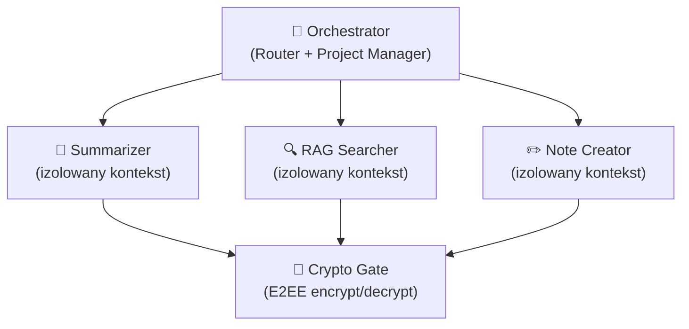

# PRD: Bezpieczny Autonomiczny Agent AI w Lilapu

> **Źródła:** [„Lokalne nie znaczy bezpieczne"](https://www.kaggle.com/writeups/katarzynadrag/lokalne-nie-znaczy-bezpieczne-clawdbot-i-iluz) · [„Ethical Hacker Mentor"](https://www.kaggle.com/writeups/katarzynadrag/ethical-hacker-mentor-testy) · Audyt bezpieczeństwa Lilapu
>
> **Ostatnia aktualizacja:** 2026-02-28

---

## Status

| Faza | Status | Data |
|------|--------|------|
| Phase 1: Hardening | ✅ Zrobione | 2026-02-28 |
| Phase 3: RAG Sanitization | ✅ Zrobione | 2026-02-28 |
| Phase 2: Validator Layer | ⏸️ Gdy agent | — |
| Phase 4: Hub & Spoke | ⏸️ Gdy agent | — |
| Phase 5: Audit Trail | ⏸️ Gdy agent | — |

> Phase 2-5 wymagane tylko gdy Lilapu zyska autonomiczne features (agent sam decyduje o akcjach). Dziś Lilapu jest narzędziem asystenckim — user kontroluje każdą interakcję.

---

## 1. Problem

Lilapu jest dziś **narzędziem asystenckim** — użytkownik nakazuje, AI odpowiada. Brak autonomii = brak ryzyka agenckiego. Ale roadmap może zakładać inteligentniejszą automatyzację:

- Proaktywne sugestie na podstawie RAG → agent decyduje KIEDY się odezwać
- Pipeline OCR → Notatka → Embeddingi → agent decyduje CO łączyć
- Auto-podsumowania bez kliknięcia → agent decyduje CO podsumować

Każdy krok w stronę autonomii otwiera wektory z artykułu o ClawdBot. Ten dokument definiuje **jak budować agenta bezpiecznie od początku**.

### 1.1 Implikacje Bielika Open-Source

Lilapu używa **Bielika** (SpeakLeash, open-source) hostowanego na RunPod zamiast komercyjnego API (OpenAI, Anthropic). To zmienia profil ryzyka:

| | Komercyjne API | Bielik OS (RunPod) |
|---|---|---|
| **Data residency** | Dane lecą do vendora | ✅ Zostają na Twoim RunPodzie |
| **Zero-retention** | Musisz ufać vendorowi | ✅ Kontrolujesz infra |
| **Fine-tuning na safety** | Ograniczone / drogie | ✅ Możesz fine-tunować na odrzucanie injection |
| **Anti-injection RLHF** | Masywny safety training | ⚠️ Mniej guardrails — **Validator jest jedyną barierą** |
| **Structured output** | Natywne function calling | ⚠️ vLLM nie gwarantuje JSON — **defensywny parser wymagany** |
| **Content filtering** | Wbudowane filtry | ⚠️ **Twoja odpowiedzialność** |
| **Model patching** | Vendor łata za Ciebie | ⚠️ Musisz śledzić i aktualizować sam |

> **UWAGA:** Z Bielikiem OS nie ma vendor safety net. Gdy zdecydujesz się na agenta, **Validator Layer (Phase 2) jest P0**.

---

## 2. Zasady Architektoniczne (do zastosowania gdy agent)

### 2.1 Hub & Spoke zamiast Sequential



**Dlaczego:** Każdy sub-agent ma własny, czysty kontekst. Prompt injection w jednej domenie nie „zaraża" innych.

### 2.2 Separacja Cognitive ↔ Executive

```
LLM → { action: "save_note", params: {...} }
  → Validator: czy action ∈ allowlist? params spełniają schemat?
    → Executive: ctx.db.insert(...)
```

**Zasada:** LLM nigdy nie wywołuje kodu bezpośrednio. Zawsze przechodzi przez walidator.

### 2.3 Nominal Determinism (nazwy mają znaczenie)

Orchestrator routuje po **nazwie** agenta, nie po jego instrukcjach. Nazwy muszą być neutralne i opisowe:

| ❌ Źle | ✅ Dobrze |
|--------|----------|
| `CodeBreaker` | `security_analyzer` |
| `SmartBot` | `transcription_summarizer` |
| `Helper` | `note_creator_v1` |

---

## 3. Model Bezpieczeństwa (5 warstw)

### Warstwa 1: LLM-Level (Prompt Injection)

| Zagrożenie | Mitygacja | Status |
|------------|-----------|--------|
| User prompt injection | System prompt **server-side** w `ai.ts` | ✅ Zrobione |
| Indirect prompt injection (z RAG) | `sanitizeRagContext()` — strip injection patterns PL/EN | ✅ Zrobione |
| Jailbreak → niechciana akcja | **Validator layer** — gdy agent | ⏸️ Phase 2 |
| Halucynacja → „realne zdarzenie" | Agent nie ma efektów ubocznych bez Validator | ⏸️ Phase 2 |

### Warstwa 2: Memory-Level (Zatrucie pamięci)

| Zagrożenie | Mitygacja | Status |
|------------|-----------|--------|
| Poisoned input → pamięć agenta | Lilapu **nie ma** autonomicznej pamięci | ✅ By design |
| Manipulacja embeddingów | Per-user, per-project z ownership verification | ✅ Zrobione |
| Context pollution (Token Bleed) | Hub & Spoke — gdy agent | ⏸️ Phase 4 |

### Warstwa 3: System-Level (Izolacja)

| Zagrożenie | Mitygacja | Status |
|------------|-----------|--------|
| Shell access | Agent **nie ma** — nigdy | ✅ By design |
| File system access | Tylko Convex DB | ✅ By design |
| Network requests | Hardcoded RunPod endpoints, server-side | ✅ By design |
| Privilege escalation | `requireAuth()` we wszystkich actions | ✅ Zrobione |

### Warstwa 4: Psychologiczna

| Zagrożenie | Mitygacja | Status |
|------------|-----------|--------|
| „Lokalny = bezpieczny" false sense | UI komunikuje: gdzie dane przetwarzane, co jest E2EE | ✅ By design |
| Blind trust w AI output | Banner „Wygenerowane przez AI" | ⏸️ Phase 5 |
| Auto-actions without awareness | Activity log — gdy agent | ⏸️ Phase 5 |

### Warstwa 5: External Exploitation

| Zagrożenie | Mitygacja | Status |
|------------|-----------|--------|
| Agent jako wektor sieciowy | Brak dostępu do sieci poza hardcoded endpoints | ✅ By design |
| Exposed endpoints | Auth + API keys + CORS whitelist | ✅ Zrobione |
| Data exfiltration via AI | E2EE, zero plaintext embeddings | ✅ By design |

---

## 4. Co zostało zrobione (Phase 1 + 3)

### Phase 1: Hardening (2026-02-28) ✅

| Zmiana | Plik |
|--------|------|
| Auth guards (`requireAuth`) + input size limits | `ai.ts` (8 actions), `rag.ts` (3 actions) |
| Timing-safe key comparison (XOR) | `http.ts` |
| `getAudioUrl` ownership check | `transcriptions.ts` |
| Rate limiting + payload size limits | `http.ts` |
| Input validation (string lengths) | `transcriptions.ts` (via `validation.ts`) |
| Email validation | `waitlist.ts` |
| Usunięcie `'unsafe-eval'` z CSP | `tauri.conf.json` |
| Error message masking | `server.py` |
| CORS localhost → `ALLOW_LOCALHOST` env | `server.py` |
| Payload size limits (WS + HTTP) | `server.py` |

### Phase 3: RAG Sanitization (2026-02-28) ✅

| Zmiana | Plik |
|--------|------|
| `sanitizeRagContext()` — 16 wzorców PL/EN | `ai.ts` |
| Injection patterns: `[system]`, `ignore previous`, `ignoruj poprzednie`, `you are now`, `jesteś teraz`, `act as`, `udawaj że`, itd. | Zintegrowane z `chat` action |

---

## 5. Co pozostaje (gdy agent)

### Phase 2: Validator Layer + Red-Team Testing (~12h)

- `agentValidator.ts` — allowlist dozwolonych akcji + schema validation
- Defensywny JSON parser dla Bielika (tolerancyjny input, strict validation)
- Red-team testing z injection payloads (PL/EN/mixed, JSON smuggling)

### Phase 4: Hub & Spoke Orchestrator (~16h)

- Orchestrator z routingiem do sub-agentów
- Sub-agents: Summarizer, RAG Searcher, Note Creator
- Context isolation per sub-agent + Compaction strategy
- E2EE Crypto Gate (sub-agents operują na plaintext, Gate szyfruje I/O)

### Phase 5: Audit Trail & UI (~8h)

- `agentAuditLog` tabela w Convex
- Activity log UI — historia autonomicznych akcji agenta
- AI content banners + Cost guard monitoring

---

## 6. Kluczowe Decyzje

| Decyzja | Wybór | Uzasadnienie |
|---------|-------|--------------|
| LLM backend | **Bielik OS (self-hosted)** | Privacy-first, zero data do 3rd party |
| Agent memory | **Brak**, opt-in z user confirmation w przyszłości | Główny wektor ataku z artykułu ClawdBot |
| Shell/FS access | **Nigdy** | Lilapu ≠ agent systemowy |
| LLM → DB writes | **Przez Validator** (gdy agent) | Bielik OS nie ma vendor safety net |
| Structured output | **Defensywny parser** (gdy agent) | vLLM nie gwarantuje JSON |
| Error handling | **Masked for user, detailed in logs** | Prevent infra leakage |
| Model updates | **Quarterly review** | Brak auto-patching |

---

> **Bezpieczeństwo nie jest funkcją geografii danych, lecz funkcją architektury.**
> — Katarzyna Drąg, Kaggle 2026
